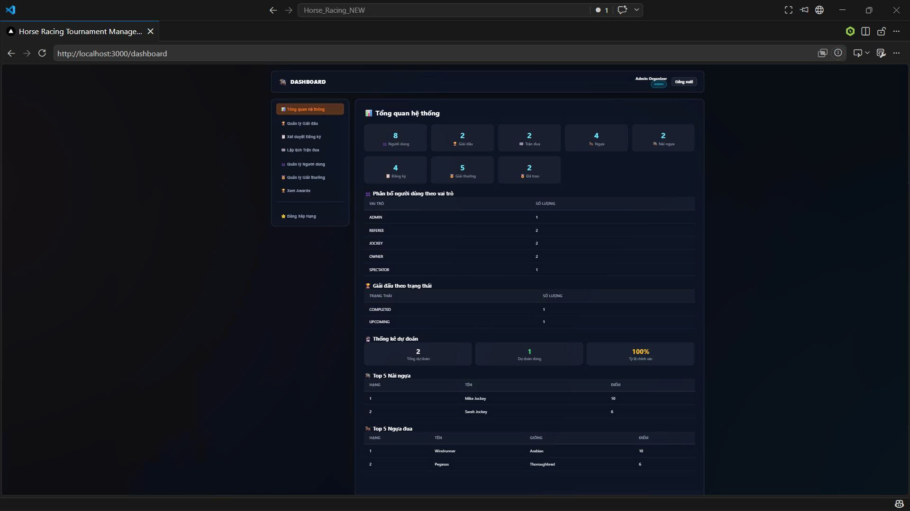
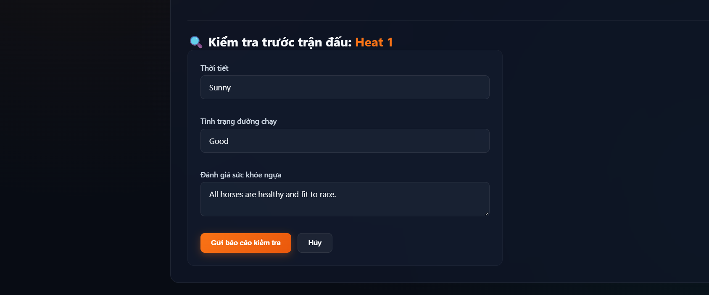
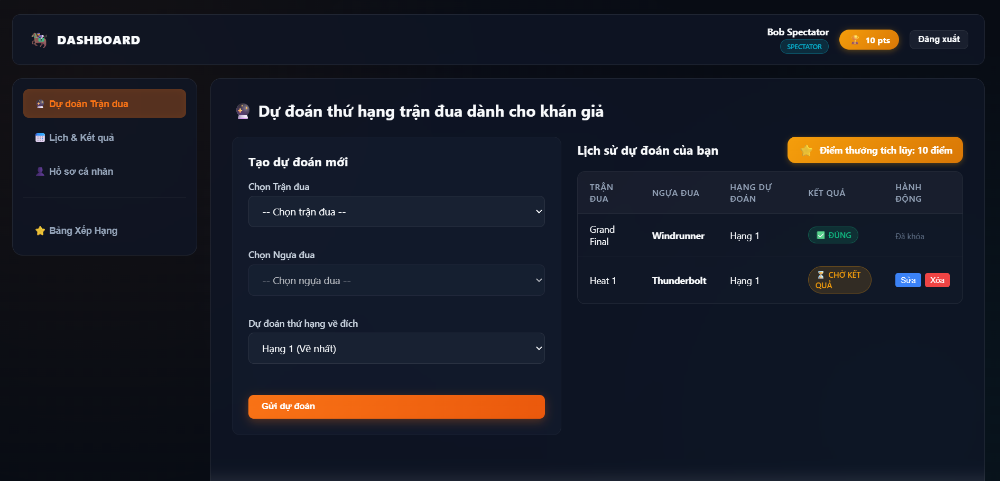
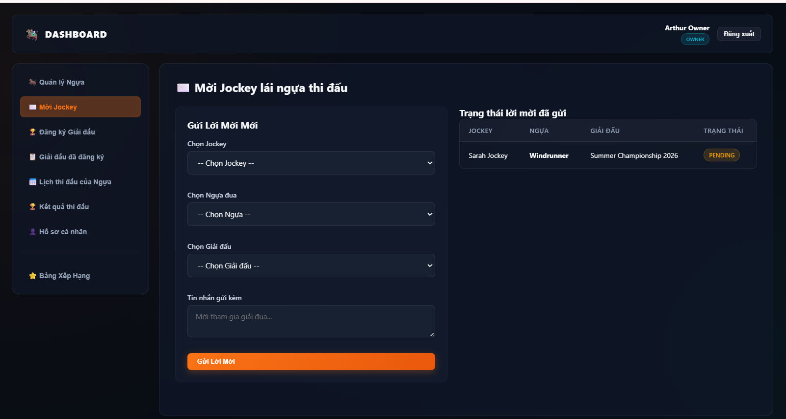

# 🏇 Horse Racing Tournament Management System (HRTMS)

[](https://fastapi.tiangolo.com/)
[](https://nextjs.org/)
[](https://react.dev/)
[](https://www.microsoft.com/sql-server)
[](https://tailwindcss.com/)
[](https://www.python.org/)
[](https://developer.mozilla.org/en-US/docs/Web/JavaScript)

Hệ thống Quản lý Giải đua ngựa - Dự án thực hành môn **Công nghệ Phần mềm (CNPM)**. 

Dự án này là một ứng dụng Web hoàn chỉnh (Full-Stack) phục vụ cho việc tổ chức, đăng ký, giám sát và tham gia dự đoán giải đua ngựa. Hệ thống phân quyền chặt chẽ cho 5 đối tượng người dùng với giao diện Dashboard tối ưu riêng biệt.

---

## ✨ Điểm nổi bật & Tính năng chính

- 📊 **Dashboard Toàn Diện**: Giao diện trực quan cho từng vai trò người dùng, thống kê thời gian thực và quản lý tài nguyên.
- ⚙️ **Thuật toán Kiểm tra Xung đột (Conflict Checking)**: Tự động phát hiện và ngăn chặn trùng lịch thi đấu của nài ngựa, ngựa hoặc trùng lịch commit của trọng tài trong khoảng thời gian quy định (2 giờ).
- 🏆 **Xếp hạng & Trao giải tự động (Auto-Awarding & Leaderboards)**: Hệ thống tự động tính điểm tích lũy, phân hạng và xếp giải cho ngựa & nài ngựa dựa trên kết quả các vòng đấu.
- 🔮 **Dự đoán Thưởng (Spectator Rewards Engine)**: Khán giả có thể xem thông số phân tích phong độ của ngựa/nài để thực hiện dự đoán, tích lũy điểm thưởng và đổi thưởng.
- 🔒 **Phân quyền & Bảo mật**: Xác thực người dùng bằng JWT (JSON Web Tokens), phân quyền truy cập API chi tiết theo vai trò tài khoản.

---

## 👥 Phân quyền Vai trò trong Hệ thống

| Vai trò | Mô tả chức năng chính |
| :--- | :--- |
| **👑 Admin (Quản trị viên)** | Quản lý toàn bộ người dùng, duyệt đăng ký tham gia giải đấu, lập lịch trình thi đấu (Races), định nghĩa các gói giải thưởng (Prizes) và giám sát hoạt động hệ thống. |
| **🏁 Referee (Trọng tài)** | Kiểm tra sức khỏe ngựa/nài trước giờ đua, ghi nhận kết quả vị trí đua (Results), báo cáo vi phạm luật đua (Violations) và xác nhận kết quả hai bước (Result Confirmation). |
| **🚜 Horse Owner (Chủ ngựa)** | Quản lý thông tin đàn ngựa chiến, gửi đăng ký tham gia giải đấu, gửi lời mời ký hợp đồng với Nài ngựa (Jockeys), xem chi tiết lịch trình và kết quả thi đấu. |
| **🏇 Jockey (Nài ngựa)** | Cập nhật hồ sơ năng lực (chiều cao, cân nặng, tiểu sử), nhận/từ chối lời mời thi đấu từ chủ ngựa, xem lịch đua cá nhân và bảng xếp hạng thành tích tổng. |
| **🎟️ Spectator (Khán giả)** | Tra cứu lịch thi đấu, xem bảng xếp hạng ngựa & nài ngựa, đặt dự đoán thứ hạng cuộc đua để tích lũy điểm thưởng (Reward Points). |

---

## 📸 Ảnh chụp Giao diện ứng dụng (Screenshots)

### 📊 Hệ thống Dashboard của Admin


### 🩺 Giao diện Kiểm tra & Giám sát của Trọng tài (Referee)


### 🔮 Phân hệ Dự đoán Thưởng cho Khán giả (Spectator)


### 🏇 Quản lý lời mời thi đấu của Chủ ngựa dành cho Nài ngựa (Jockey Invitation)


---

## 🛠️ Hướng dẫn cài đặt & Khởi chạy ứng dụng (Getting Started)

### 1. Cơ sở dữ liệu (Database Setup)
Hệ thống sử dụng cơ sở dữ liệu **Microsoft SQL Server**.
1. Cài đặt MS SQL Server (LocalDB hoặc SQL Server Express).
2. Tạo cơ sở dữ liệu mới có tên là: `HorseRacing`.
3. Chạy file script [source-code/database/schema.sql](file:///e:/CNPM/Project/Horse_Racing_NEW/source-code/database/schema.sql) để khởi tạo cấu trúc bảng biểu.

### 2. Backend API Setup (FastAPI)
1. Di chuyển vào thư mục backend:
   ```bash
   cd source-code/backend
   ```
2. Khởi tạo môi trường ảo Python và kích hoạt:
   ```bash
   python -m venv .venv
   # Kích hoạt trên Windows (PowerShell):
   .venv\Scripts\Activate.ps1
   ```
3. Cài đặt các gói thư viện cần thiết:
   ```bash
   pip install -r requirements.txt
   ```
4. Copy file cấu hình `.env` từ file [.env.example](file:///e:/CNPM/Project/Horse_Racing_NEW/source-code/backend/.env.example) và chỉnh sửa thông số kết nối Database:
   ```bash
   cp .env.example .env
   ```
5. Chạy file script setup để đồng bộ schema và nạp dữ liệu mẫu bằng tiếng Việt (Seed data):
   ```bash
   python db_setup.py
   ```
6. Khởi chạy Backend Server:
   ```bash
   uvicorn app.main:app --reload --port 8000
   ```

### 3. Frontend App Setup (Next.js)
1. Di chuyển vào thư mục frontend:
   ```bash
   cd ../frontend
   ```
2. Cài đặt các package của Node.js:
   ```bash
   npm install
   ```
3. Khởi chạy ứng dụng ở môi trường Phát triển:
   ```bash
   npm run dev
   ```
4. Mở trình duyệt và trải nghiệm hệ thống tại địa chỉ: **`http://localhost:3000`**

---

## 📂 Cấu trúc thư mục Dự án

```
Horse_Racing_NEW/
├── 📁 source-code/          # Mã nguồn hệ thống chính
│   ├── 📁 backend/          # FastAPI Web API (Python)
│   │   ├── 📁 app/          # Core modules: models, schemas, api routers, config...
│   │   ├── 📄 db_setup.py   # Script migration schema & seed dữ liệu tiếng Việt
│   │   └── 📄 requirements.txt
│   ├── 📁 frontend/         # Next.js App Router (React, Tailwind CSS)
│   │   ├── 📁 app/          # Dashboard, auth, components page
│   │   └── 📄 package.json
│   └── 📁 database/         # Script khởi tạo cơ sở dữ liệu
│       └── 📄 schema.sql    # Dành cho Microsoft SQL Server
│
├── 📁 doc/                  # Tài liệu quản lý dự án & Đặc tả kỹ thuật
│   ├── 📁 technical/        # Sơ đồ thiết kế ERD, sơ đồ kiến trúc hệ thống
│   ├── 📁 report/           # Báo cáo kết quả review code các chặng phát triển
│   ├── 📁 test/             # Kịch bản kiểm thử (Test cases) tự động & thủ công
│   └── 📁 plan/             # Kế hoạch phát triển chi tiết
│
├── 📁 report_latex_final/   # Thư mục mã nguồn và báo cáo LaTeX (PDF) đã xuất bản
│   ├── 📄 main.pdf          # Báo cáo đồ án tốt nghiệp chính thức (195 trang)
│   └── 📄 main.tex          # File LaTeX cấu hình biên dịch
│
└── 📄 test_bugs_report.py   # Script chạy test kiểm thử tự động hệ thống
```

---

## 🌿 Chiến lược phân nhánh Git (Git Workflow)

Dự án áp dụng quy trình kiểm soát mã nguồn chuẩn mực để tránh xung đột mã nguồn:
- **`main`**: Nhánh chính chứa phiên bản ổn định nhất và đã được kiểm thử kỹ càng, sẵn sàng để deploy.
- **`dev-GiaHuy`**: Nhánh tích hợp mã nguồn phát triển chung của toàn đội.
- **`feature/<tên_tính_năng>`**: Các nhánh con phát triển độc lập cho từng tính năng (ví dụ: `feature/jockey-profile-update`, `feature/referee-two-step-results`...) sau đó tạo Pull Request vào nhánh `dev-GiaHuy`.

---

## 👥 Đội ngũ Phát triển dự án
Dự án được thực hiện bởi nhóm sinh viên **Trường Đại học Giao thông Vận tải TP.HCM (UTH)**:
- **Hà Duy Hưng** (Trưởng nhóm)
- **Đinh Thùy Anh**
- **Hồ Nguyễn Thái Châu**
- **Lê Thị Mỹ Huệ**
- **Bùi Lê Quang Huy**
- **Nguyễn Gia Huy**
- **Đoàn Thị Thu Mây**

*Giảng viên hướng dẫn: **Thầy Nguyễn Văn Chiến***
