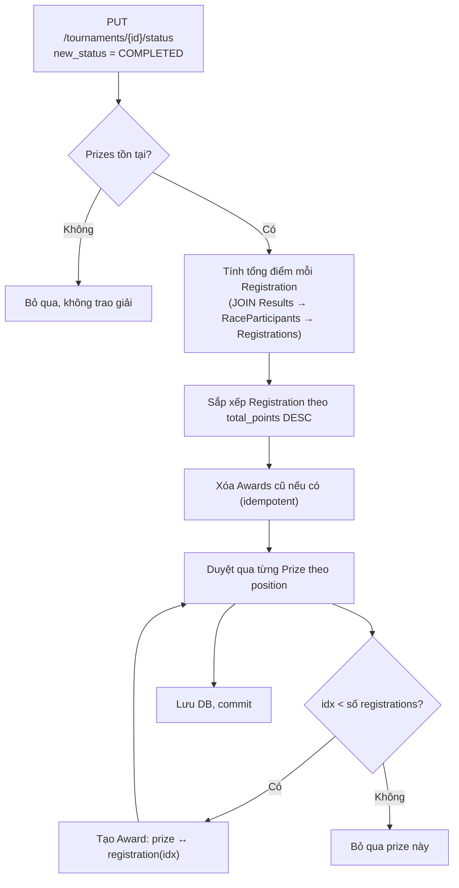

# 📋 Tổng hợp triển khai – Admin Tasks (Horse Racing System)

> **Ngày:** 25/06/2026  
> **Phase:** Admin Feature Extension  
> **Backend:** FastAPI + SQLAlchemy + SQL Server

---

## 1. Thiết kế Database – Bảng `Prizes` & `Awards`

### 1.1 Bảng `Prizes`

| Cột | Kiểu | Mô tả |
|-----|------|--------|
| `id` | INT IDENTITY PK | ID giải thưởng |
| `tournament_id` | INT FK → Tournaments | Tournament chứa giải này |
| `position` | INT | Hạng được trao (1 = nhất, 2 = nhì…) |
| `title` | NVARCHAR(100) | Tên giải ("Giải Nhất", "Grand Prize"…) |
| `prize_value` | DECIMAL(15,2) | Giá trị giải thưởng (VNĐ) |
| `description` | NVARCHAR(MAX) | Mô tả thêm |
| `created_at` | DATETIME | Thời điểm tạo |

**Constraint:** `UNIQUE (tournament_id, position)` – mỗi hạng chỉ có 1 giải/tournament.

### 1.2 Bảng `Awards`

| Cột | Kiểu | Mô tả |
|-----|------|--------|
| `id` | INT IDENTITY PK | ID bản ghi trao giải |
| `prize_id` | INT FK → Prizes | Giải thưởng được trao |
| `registration_id` | INT FK → Registrations | Cặp Horse-Jockey nhận giải |
| `awarded_at` | DATETIME | Thời điểm trao |
| `total_points` | INT | Tổng điểm tích lũy trong tournament |
| `notes` | NVARCHAR(MAX) | Ghi chú |

### 1.3 Files thay đổi

| File | Thay đổi |
|------|----------|
| [`schema.sql`](file:///c:/Users/Nguyen%20Gia%20Huy/Desktop/Horse_Racing_NEW/source-code/database/schema.sql) | Thêm DROP/CREATE cho Prizes, Awards, thêm 3 indexes |
| [`database_models.py`](file:///c:/Users/Nguyen%20Gia%20Huy/Desktop/Horse_Racing_NEW/source-code/backend/app/models/database_models.py) | Thêm class `Prize`, `Award`; cập nhật relationship Tournament |
| [`db_setup.py`](file:///c:/Users/Nguyen%20Gia%20Huy/Desktop/Horse_Racing_NEW/source-code/backend/db_setup.py) | Seed Prizes cho cả 2 tournaments, seed Awards cho Spring Derby |

---

## 2. API CRUD Prizes – `/tournaments/{id}/prizes`

> **File:** [`tournaments.py`](file:///c:/Users/Nguyen%20Gia%20Huy/Desktop/Horse_Racing_NEW/source-code/backend/app/api/v1/tournaments.py)  
> **Schema:** [`prize.py`](file:///c:/Users/Nguyen%20Gia%20Huy/Desktop/Horse_Racing_NEW/source-code/backend/app/schemas/prize.py)

| Method | Endpoint | Auth | Mô tả |
|--------|----------|------|--------|
| `GET` | `/tournaments/{id}/prizes` | Public | Lấy danh sách giải, kèm thông tin đã trao (nếu có) |
| `POST` | `/tournaments/{id}/prizes` | ADMIN | Tạo giải mới. Không cho phép nếu tournament COMPLETED |
| `PUT` | `/tournaments/{id}/prizes/{prize_id}` | ADMIN | Sửa thông tin giải. Kiểm tra trùng `position` |
| `DELETE` | `/tournaments/{id}/prizes/{prize_id}` | ADMIN | Xóa giải. Không xóa được nếu đã trao (có Award) |

**Bonus endpoint:**

| Method | Endpoint | Auth | Mô tả |
|--------|----------|------|--------|
| `GET` | `/tournaments/{id}/awards` | Public | Xem danh sách giải đã trao của tournament |

### Ví dụ Response – `GET /tournaments/2/prizes`

```json
[
  {
    "id": 1,
    "tournament_id": 2,
    "position": 1,
    "title": "Giải Nhất",
    "prize_value": 50000000.00,
    "description": "Hàng vàng + Bằng chứng nhận",
    "created_at": "2026-05-01T00:00:00",
    "awarded_to_horse": "Windrunner",
    "awarded_to_jockey": "Mike Jockey",
    "awarded_total_points": 10
  }
]
```

---

## 3. API Chuyển Trạng Thái Tournament – `PUT /tournaments/{id}/status`

> **File:** [`tournaments.py`](file:///c:/Users/Nguyen%20Gia%20Huy/Desktop/Horse_Racing_NEW/source-code/backend/app/api/v1/tournaments.py)

### Luồng chuyển trạng thái hợp lệ

```
UPCOMING ──► ACTIVE ──► COMPLETED
    └──────────────────► CANCELLED
                └──────► CANCELLED
```

| Trạng thái hiện tại | Được phép chuyển sang |
|---------------------|----------------------|
| `UPCOMING` | `ACTIVE`, `CANCELLED` |
| `ACTIVE` | `COMPLETED`, `CANCELLED` |
| `COMPLETED` | *(không thể thay đổi)* |
| `CANCELLED` | *(không thể thay đổi)* |

### Request Body

```json
{ "new_status": "COMPLETED" }
```

> [!IMPORTANT]
> Khi chuyển sang `COMPLETED`, hệ thống **tự động kích hoạt logic trao giải (Auto-Award)**.

---

## 4. Logic Tự Động Trao Giải (Auto-Award)

> **Hàm:** `_auto_award(db, tournament)` trong [`tournaments.py`](file:///c:/Users/Nguyen%20Gia%20Huy/Desktop/Horse_Racing_NEW/source-code/backend/app/api/v1/tournaments.py)

### Luồng thực thi



### Điểm kỹ thuật

- **Idempotent:** Xóa Awards cũ trước khi trao → an toàn khi chạy lại
- **Fallback:** Nếu không có kết quả nào (chưa nhập điểm), xếp hạng các Registration APPROVED với 0 điểm
- **SQL Query:** Dùng `text()` query với GROUP BY để tính tổng điểm từ bảng Results

---

## 5. Phân Trang & Tìm Kiếm – Admin User List

> **File:** [`admin.py`](file:///c:/Users/Nguyen%20Gia%20Huy/Desktop/Horse_Racing_NEW/source-code/backend/app/api/v1/admin.py)

### `GET /admin/users`

| Query Param | Kiểu | Default | Mô tả |
|-------------|------|---------|--------|
| `page` | int | 1 | Trang hiện tại (≥ 1) |
| `limit` | int | 20 | Số records/trang (1–100) |
| `search` | string | null | Tìm theo username / email / full_name |
| `role_filter` | string | null | Lọc theo role: JOCKEY, OWNER, REFEREE, SPECTATOR |
| `is_active` | bool | null | Lọc theo trạng thái tài khoản |

### Ví dụ

```
GET /api/v1/admin/users?page=1&limit=10&search=jockey&role_filter=JOCKEY
GET /api/v1/admin/users?is_active=false&page=1&limit=20
```

---

## 6. API Thống Kê Admin – `GET /admin/stats`

> **File:** [`admin.py`](file:///c:/Users/Nguyen%20Gia%20Huy/Desktop/Horse_Racing_NEW/source-code/backend/app/api/v1/admin.py)

**Auth:** ADMIN only

### Response structure

```json
{
  "summary": {
    "total_users": 8,
    "total_tournaments": 2,
    "total_races": 2,
    "total_horses": 4,
    "total_jockeys": 2,
    "total_registrations": 4,
    "total_prizes": 5,
    "total_awards": 2
  },
  "users_by_role": {
    "JOCKEY": 2, "OWNER": 2, "REFEREE": 2, "SPECTATOR": 1, "ADMIN": 1
  },
  "tournaments_by_status": {
    "UPCOMING": 1, "COMPLETED": 1
  },
  "races_by_status": {
    "SCHEDULED": 1, "COMPLETED": 1
  },
  "top_jockeys": [
    { "jockey_id": 1, "full_name": "Mike Jockey", "rank": 1, "total_points": 10 }
  ],
  "top_horses": [
    { "horse_id": 2, "name": "Windrunner", "breed": "Arabian", "rank": 1, "total_points": 10 }
  ],
  "predictions": {
    "total": 2,
    "correct": 1,
    "pending": 1,
    "global_accuracy_rate": 100.0
  }
}
```

---

## 7. Leaderboard Spectator – `GET /spectators/leaderboard`

> **File:** [`spectators.py`](file:///c:/Users/Nguyen%20Gia%20Huy/Desktop/Horse_Racing_NEW/source-code/backend/app/api/v1/spectators.py)

**Auth:** Public (không cần login)

| Query Param | Kiểu | Default | Giới hạn |
|-------------|------|---------|----------|
| `page` | int | 1 | ≥ 1 |
| `limit` | int | 10 | 1–50 |

### Response structure

```json
{
  "page": 1,
  "limit": 10,
  "total": 1,
  "data": [
    {
      "rank": 1,
      "spectator_id": 1,
      "username": "spectator1",
      "full_name": "Bob Spectator",
      "reward_points": 10,
      "total_predictions": 2,
      "correct_predictions": 1,
      "accuracy_rate": 100.0,
      "favorite_horse_breed": "Thoroughbred"
    }
  ]
}
```

---

## 8. Tổng hợp tất cả Files thay đổi

| File | Loại | Nội dung thay đổi |
|------|------|-------------------|
| [`schema.sql`](file:///c:/Users/Nguyen%20Gia%20Huy/Desktop/Horse_Racing_NEW/source-code/database/schema.sql) | MODIFY | Thêm bảng Prizes, Awards, 3 indexes mới |
| [`database_models.py`](file:///c:/Users/Nguyen%20Gia%20Huy/Desktop/Horse_Racing_NEW/source-code/backend/app/models/database_models.py) | MODIFY | Thêm ORM models Prize, Award; cập nhật Tournament relationships |
| [`prize.py`](file:///c:/Users/Nguyen%20Gia%20Huy/Desktop/Horse_Racing_NEW/source-code/backend/app/schemas/prize.py) | **NEW** | Pydantic schemas: PrizeCreate/Update/Out, AwardOut |
| [`tournaments.py`](file:///c:/Users/Nguyen%20Gia%20Huy/Desktop/Horse_Racing_NEW/source-code/backend/app/api/v1/tournaments.py) | MODIFY | CRUD Prizes, `/status` endpoint, auto-award logic, `/awards` endpoint |
| [`admin.py`](file:///c:/Users/Nguyen%20Gia%20Huy/Desktop/Horse_Racing_NEW/source-code/backend/app/api/v1/admin.py) | MODIFY | Phân trang/tìm kiếm/lọc cho `/users`, thêm `/stats` |
| [`spectators.py`](file:///c:/Users/Nguyen%20Gia%20Huy/Desktop/Horse_Racing_NEW/source-code/backend/app/api/v1/spectators.py) | MODIFY | Thêm `/leaderboard` với phân trang |
| [`db_setup.py`](file:///c:/Users/Nguyen%20Gia%20Huy/Desktop/Horse_Racing_NEW/source-code/backend/db_setup.py) | MODIFY | Seed Prizes và Awards mẫu |

---

## 9. Hướng dẫn Test

> [!TIP]
> Sau khi chạy `db_setup.py` để reset DB, tất cả seed data mới sẽ có sẵn.

### Bước 1 – Reset DB

```bash
cd source-code/backend
python db_setup.py
```

### Bước 2 – Khởi động server

```bash
uvicorn app.main:app --reload
```

### Bước 3 – Test trên Swagger UI: `http://localhost:8000/docs`

#### Kiểm tra Prizes CRUD
```
POST   /api/v1/tournaments/1/prizes          ← tạo giải cho Summer Championship
GET    /api/v1/tournaments/1/prizes          ← xem danh sách
PUT    /api/v1/tournaments/1/prizes/{id}     ← sửa giải
DELETE /api/v1/tournaments/1/prizes/{id}     ← xóa giải
```

#### Kiểm tra Auto-Award
```
PUT /api/v1/tournaments/1/status   Body: {"new_status": "ACTIVE"}
PUT /api/v1/tournaments/1/status   Body: {"new_status": "COMPLETED"}
GET /api/v1/tournaments/1/awards   ← xem giải đã trao
```

#### Kiểm tra Admin
```
GET /api/v1/admin/stats
GET /api/v1/admin/users?page=1&limit=5&search=jockey
GET /api/v1/admin/users?role_filter=OWNER&is_active=true
```

#### Kiểm tra Leaderboard
```
GET /api/v1/spectators/leaderboard
GET /api/v1/spectators/leaderboard?page=1&limit=5
```

---

> [!NOTE]
> Tournament đã `COMPLETED` không thể thêm/sửa/xóa Prize.  
> Tournament đã `COMPLETED` hoặc `CANCELLED` không thể đổi status tiếp.  
> Awards tự động xóa và tạo lại nếu gọi lại `_auto_award` (idempotent).
