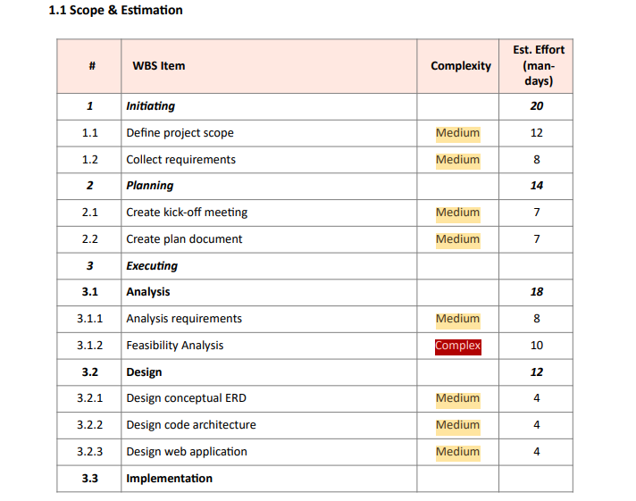
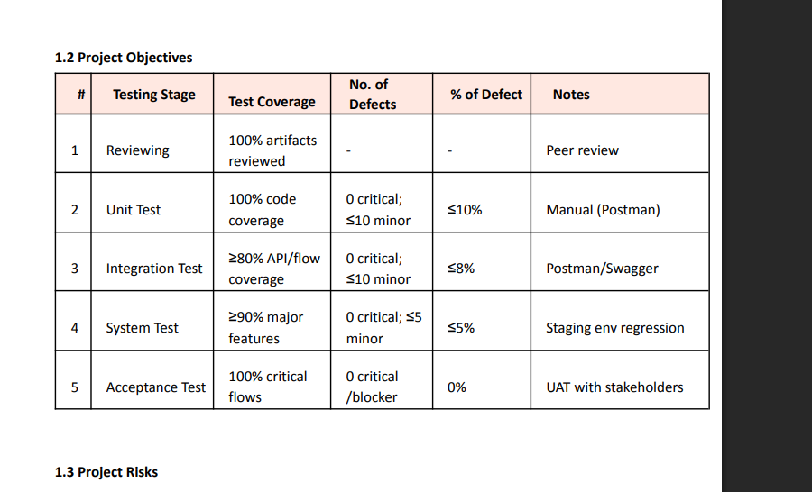
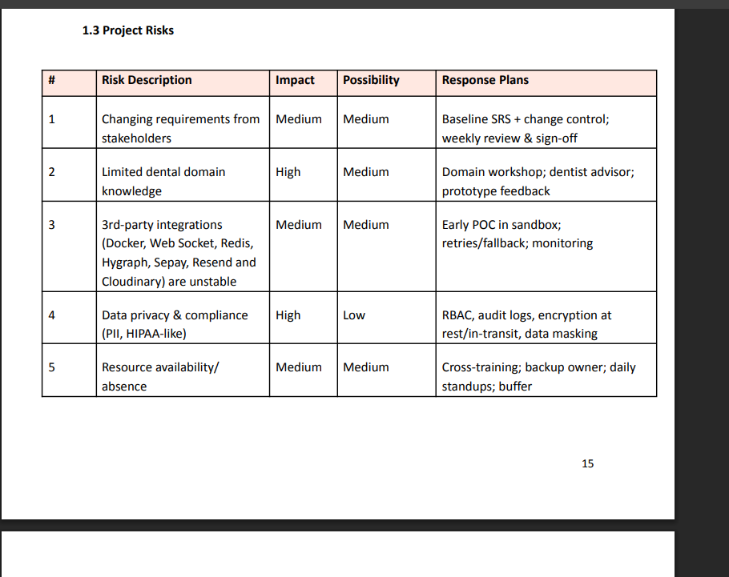
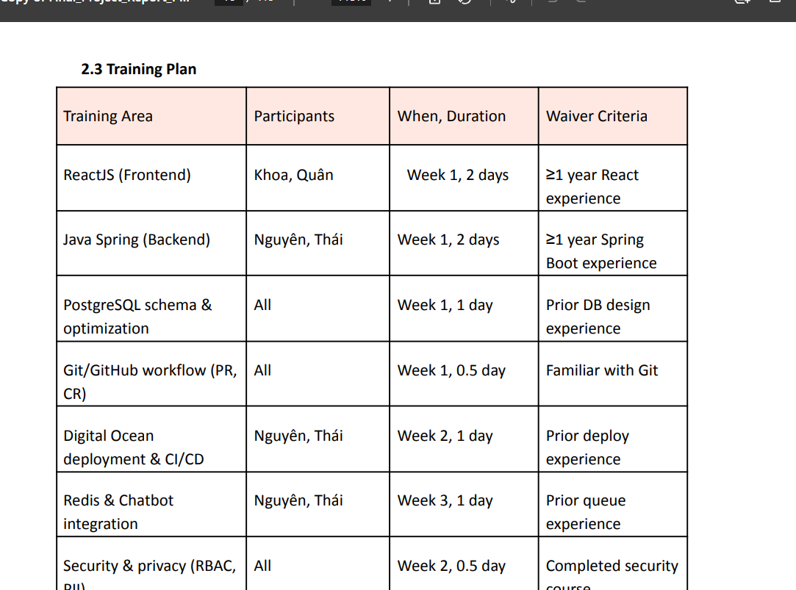
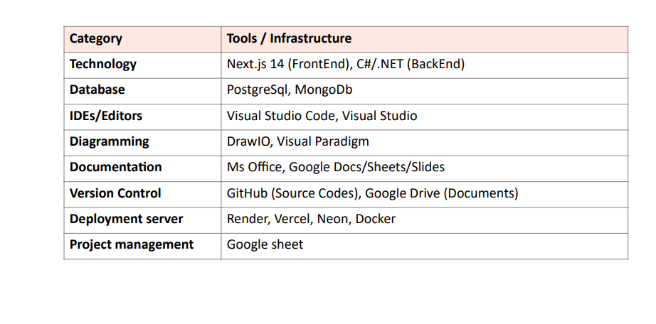

Bố cục viết latex (FULL TIẾNG ANH)

Viết không ưu tiên theo thứ tự Chương (phần mục) mà ưu tiên vào tiến độ hoàn thiện project của team

Phần 1: (Thùy Anh): Giới thiệu project – dự án

1. Tổng quan (project – team)

2. Bối cảnh của project

3. Một vài hệ thống trên thị trường => ưu và nhược điểm

4. Cơ hội

5. Tầm nhìn

6. Kế hoạch tầm nhìn (phạm vi – nhược điểm)

Phần 2: (Duy Hưng tạo Table)  Project Management Plan - Kế hoạch quản lý dự án

1.1. Scope & Estimation (Phạm vi & Ước lượng) bao gồm:

- Bảng phân rã cấu trúc công việc (WBS) chi tiết cho các nhóm mô-đun tính năng trong project

- Đánh giá độ phức tạp (Simple/Medium/Complex) và ước lượng triển khai cụ thể theo ngày-công (man-days) của từng thành viên nhóm

Ví dụ:

1.2 Project Objectives (Mục tiêu dự án):

- xác định đc các tiêu chí chất lượng

- tỷ lệ lỗi tối đa cho phép qua từng giai đoạn kiểm thử (Reviewing, Unit Test, Integration Test, System Test, Acceptance Test)

Ví dụ:

1.3 Độ rủi ro – Risks project

- Liệt kê rủi ro tiềm ẩn

- Mức tác động/ảnh hưởng của rủi ro (impact)

- khả năng xảy ra và kế hoạch ứng phó chi tiết

Ví dụ:

2.  Management Approach (Phương pháp quản lý)

- trình bày tổng quát: nhóm áp dụng mô hình nào trong việc xây dựng bài (agile, waterfall…), chu kì làm bài tuần như nào, họp vận hành…

- quy định các biện pháp nào để ngăn lỗi, kiểm thử, coding…

- Tạo bảng lịch trình đào tạo nội bộ thành viên trong các tuần đầu về công nghệ sử dụng như ReactJS, Java Spring, PostgreSQL, Git, Docker….

Vd:

3. Sản phẩm của dự án xuyên suốt từ Tuần 1 đến Tuần 15 (bao gồm các tài liệu Charter, SRS, thiết kế DB, Prototype, các gói API cốt lõi, hệ thống thanh toán, báo cáo, và cuối cùng là tài liệu hướng dẫn sử dụng kèm cách triển khai)

4. Bảng phân công dựa theo : D~Do; R~Review; S~Support; I~Informed; - Omitted

5. Bảng giao tiếp nhóm ( hình thức/thời gian biểu để họp – làm bài – phân công )

6. Configuration Management (Quản lý cấu hình)

- 6.1 Document Management (Quản lý tài liệu): Quy trình lưu trữ và kiểm soát phiên bản tài liệu trên môi trường chung như nào (latex)

- 6.2 Source Code Management (Quản lý mã nguồn): Quy định về luồng làm việc trên Git/GitHub (quy tắc đặt tên nhánh, tạo Pull Request và merge code)

- 6.3 Tools & Infrastructures (Công cụ & Cơ sở hạ tầng)

Phần 3: TÀI LIỆU SRS

1 Tổng quan (overview) (Duy Hưng)

- Chèn Context diagram

- các luồng dữ liệu tương tác (Data Flows) giữa hệ thống quản lý hệ thống đua ngựa và các tác nhân xung quanh
