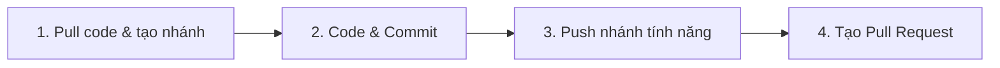
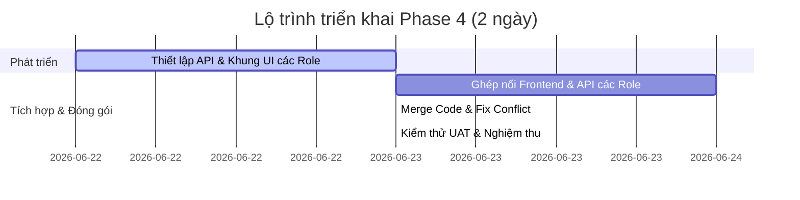

# 🚀 KẾ HOẠCH TRIỂN KHAI VÀ PHÂN CÔNG NHIỆM VỤ PHASE 4
### Phân hệ: Hoàn thiện Toàn bộ Chức năng & UAT (22/06/2026 - 23/06/2026)

Tài liệu này cung cấp hướng dẫn quy trình làm việc Git, phân chia vai trò, nhánh đề xuất và tiến độ thời gian cụ thể cho từng thành viên trong nhóm để hoàn thành giai đoạn cuối cùng của dự án.

---

## 🔄 1. QUY TRÌNH LÀM VIỆC GIT (GIT WORKFLOW)

Tất cả thành viên bắt buộc tuân thủ quy trình 4 bước dưới đây để tránh xung đột mã nguồn (conflict):



### Bước 1: Đồng bộ code mới nhất và tạo nhánh tính năng
Trước khi bắt đầu code, chuyển sang nhánh `dev-GiaHuy`, kéo code mới nhất về và tạo nhánh tính năng của bạn:
```bash
git checkout dev-GiaHuy
git pull origin dev-GiaHuy
git checkout -b feature/[ten-nhanh-de-xuat]
```

### Bước 2: Phát triển và Commit code
Viết code cho các tính năng được giao, kiểm tra chạy thử local không lỗi và commit:
```bash
git add .
git commit -m "feat: mo ta ngan gon chuc nang da lam"
```

### Bước 3: Push nhánh lên Remote repository
Đẩy nhánh làm việc của bạn lên GitHub:
```bash
git push origin feature/[ten-nhanh-de-xuat]
```

### Bước 4: Tạo Pull Request (PR)
Truy cập kho chứa mã nguồn trên trình duyệt, tạo Pull Request hướng từ nhánh của bạn vào nhánh đích **`dev-GiaHuy`** để Trưởng nhóm (Duy Hưng) review và duyệt merge.

---

## 📋 2. BẢNG PHÂN CÔNG NHIỆM VỤ THEO VAI TRÒ HỆ THỐNG (ROLE-BASED ASSIGNMENT)

### Hoàn thiện tính năng & Đóng gói hệ thống

| Thành viên | Vai trò trong hệ thống | Nhánh đề xuất | Nội dung chính |
| :--- | :--- | :--- | :--- |
| **Huệ** | **Admin (Quản trị viên - UI)** | `feature/fe-admin-phase4-ui` | - Thiết kế tab "Cấu hình Giải thưởng" cho Admin nhập giải thưởng.<br>- Thêm nút cập nhật trạng thái giải đấu trong tab "Quản lý Giải đấu".<br>- Tạo tab "Tổng quan" vẽ biểu đồ Analytics dựa trên API stats.<br>- Thêm thanh tìm kiếm và phân trang ở danh sách User. |
| **Gia Huy** | **Admin (Quản trị viên - API)** | `feature/be-admin-phase4-prizes` | - Thiết kế bảng `Prizes` & `Awards` trong Database.<br>- Viết API CRUD Prize (`GET`, `POST`, `PUT`, `DELETE` tại `/tournaments/{id}/prizes`).<br>- Viết API chuyển trạng thái Tournament (`PUT /tournaments/{id}/status`).<br>- Xây dựng logic tự động trao giải (`Awards`) khi status đổi sang `COMPLETED`.<br>- Bổ sung params phân trang/tìm kiếm cho các API danh sách Admin.<br>- Viết API stats `/admin/stats` và Leaderboard `/spectators/leaderboard`. |
| **Thuỳ Anh** | **Horse Owner (Chủ ngựa)** | `feature/owner-profile-and-races` | - API & UI form cập nhật hồ sơ cá nhân của Chủ ngựa (`GET/PUT /owners/profile`).<br>- Tab "Lịch thi đấu của Ngựa" lọc các trận sắp diễn ra của ngựa mình.<br>- Tab "Kết quả thi đấu" hiển thị lịch sử xếp hạng/vi phạm của ngựa mình. |
| **Thái Châu** | **Jockey (Nài ngựa)** | `feature/jockey-leaderboard-filter` | - Phối hợp với Spectator tích hợp bộ lọc giải đấu ở Leaderboard chung.<br>- Bổ sung tab xem giải thưởng đã đạt được trong tab Hồ sơ cá nhân của Jockey. |
| **Bùi Huy** | **Referee (Trọng tài)** | `feature/referee-detail-participants` | - Cập nhật giao diện RefereePanel: Khi click vào một trận đấu, hiển thị bảng danh sách đầy đủ (Làn số, Tên ngựa, Tên Jockey, Trạng thái) thay vì chỉ hiển thị số lượng. |
| **Thu Mây** | **Spectator (Khán giả)** | `feature/spectator-lock-and-leaderboard` | - Backend API check `datetime.utcnow() > race.race_time` khi gửi dự đoán.<br>- Frontend disable form dự đoán khi quá giờ của trận đấu.<br>- Tạo dropdown lọc bảng xếp hạng Ngựa & Jockey theo giải đấu.<br>- Thêm tab "Khán giả xuất sắc" hiển thị Top 10 Spectator có điểm cao nhất. |
| **Duy Hưng** | **Team Leader** | — *(Nhánh chính dev-GiaHuy)* | - Review code, điều phối chung, hỗ trợ các thành viên giải quyết conflict.<br>- Làm sạch Database và chạy UAT kiểm thử toàn bộ luồng nghiệp vụ sau khi merge. |

---

## 📅 3. THỜI GIAN TRIỂN KHAI (TIMELINE)

Giai đoạn Phase 4 sẽ diễn ra khẩn trương trong **2 ngày**:



### Ngày 1 (22/06/2026): Phát triển API & Khung UI theo phân hệ Role
*   **Phân hệ Admin:** Gia Huy hoàn thành cập nhật Database Schema và các API giải thưởng, status trước 18h để Huệ tích hợp. Huệ thiết kế khung giao diện cấu hình giải thưởng và trang Analytics.
*   **Phân hệ Horse Owner / Jockey / Referee / Spectator:** Các thành viên phụ trách tự triển khai cả API Backend và dựng sẵn khung UI (form nhập, bảng biểu, tabs) liên quan đến vai trò của mình.

### Ngày 2 (23/06/2026): Ghép nối API các Role, Merge Code & Nghiệm thu (UAT)
*   **Sáng (đến 12h00):** Hoàn thành việc kết nối dữ liệu Frontend - Backend cho từng Role và chạy kiểm thử nội bộ trên máy local.
*   **Chiều (13h00 - 15h00):** Các thành viên tạo Pull Request để Team Leader (Duy Hưng) tiến hành review và merge các nhánh tính năng của từng Role vào nhánh chung `dev-GiaHuy`.
*   **Chiều (từ 15h00):** Chạy lại script `db_setup.py` để đồng bộ lại dữ liệu sạch. Cả nhóm thực hiện nghiệm thu UAT theo kịch bản liên hoàn trên các vai trò hệ thống đã thiết lập.
