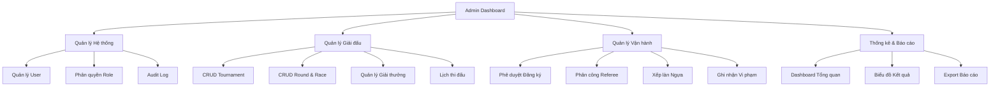

# 📋 Báo cáo Role ADMIN — Horse Racing Tournament Management System

> **Hệ thống:** Horse Racing Tournament Management System  
> **Stack:** FastAPI (Python) + Next.js (React) + SQL Server

---

## 1. ✅ Tính năng ĐÃ CÓ (Đã triển khai)

### 1.1 Backend (API)

| Tính năng                                 | Endpoint                                  | File             |
| ----------------------------------------- | ----------------------------------------- | ---------------- |
| Tạo giải đấu mới                          | `POST /tournaments/`                      | `tournaments.py` |
| Tạo vòng đấu (round) trong giải đấu       | `POST /tournaments/{id}/rounds`           | `tournaments.py` |
| Xem danh sách tất cả đăng ký              | `GET /tournaments/{id}/registrations`     | `tournaments.py` |
| Phê duyệt / Từ chối đăng ký thi đấu       | `PUT /tournaments/registrations/{reg_id}` | `tournaments.py` |
| Tạo trận đua trong vòng đấu               | `POST /races/rounds/{round_id}/races`     | `races.py`       |
| Lên lịch / Chỉnh sửa thông tin trận đua   | `PUT /races/{id}/schedule`                | `races.py`       |
| Phân công trọng tài (referee) cho trận    | `PUT /races/{id}/assign-referee`          | `races.py`       |
| Thêm ngựa vào đường đua (lane assignment) | `POST /races/{id}/participants`           | `races.py`       |
| Ghi nhận kết quả cuộc đua                 | `POST /results/{race_id}/results`         | `results.py`     |
| Ghi nhận vi phạm (violation)              | `POST /results/{race_id}/violations`      | `results.py`     |
| Xem bảng xếp hạng tổng                    | `GET /results/rankings`                   | `results.py`     |
| Đăng nhập / Xác thực JWT                  | `POST /auth/token`                        | `auth.py`        |
| Xem profile cá nhân                       | `GET /auth/me`                            | `auth.py`        |

### 1.2 Frontend (UI Dashboard)

| Tab UI                   | Mô tả                                                                                                                                          |
| ------------------------ | ---------------------------------------------------------------------------------------------------------------------------------------------- |
| 🏆 **Quản lý Giải đấu**  | Form tạo giải đấu (tên, mô tả, ngày bắt đầu/kết thúc, địa điểm); Form tạo vòng đấu; Bảng danh sách giải đấu                                    |
| 📋 **Xét duyệt Đăng ký** | Danh sách đăng ký theo từng giải đấu; Nút Duyệt / Từ chối từng đăng ký                                                                         |
| 🏁 **Lập lịch Trận đua** | Form tạo trận đua (chọn round, tên, thời gian, điều kiện sân, khoảng cách, phân công referee); Form xếp làn cho ngựa-jockey; Bảng lịch thi đấu |
| ⭐ **Bảng Xếp Hạng**     | Tab chung dùng được cho tất cả role                                                                                                            |

### 1.3 Bảo mật & Phân quyền

- Role-based access control (RBAC) qua `RoleChecker` middleware
- JWT token authentication
- Admin được phân quyền rõ ràng ở các route quan trọng

---

## 2. ❌ Tính năng CHƯA CÓ (Còn thiếu)

### 2.1 Quản lý User (User Management)

> [!IMPORTANT]
> Đây là thiếu sót **nghiêm trọng nhất** của role Admin hiện tại.

- ❌ Không có API `GET /admin/users` — Admin **không thể xem danh sách tất cả user** trong hệ thống
- ❌ Không có API để Admin **tạo tài khoản cho user** (chỉ có self-register)
- ❌ Không có API để Admin **khóa/vô hiệu hóa** tài khoản user
- ❌ Không có API để Admin **xóa user** khỏi hệ thống
- ❌ Không có API để Admin **thay đổi role** của một user
- ❌ Không có UI Tab nào cho "Quản lý người dùng" trong dashboard

### 2.2 Quản lý Trọng tài (Referee Management)

> [!WARNING]
> Danh sách referee trên FE đang được **hard-code** thay vì gọi API thực.

- ❌ Không có API `GET /referees` để lấy danh sách trọng tài động
- ❌ Không có UI để Admin **xem profile chi tiết** của referee (certification level, v.v.)
- ❌ Referee list trong dashboard hiện đang bị hard-code: `[{ id: 1, name: "John Referee" }, { id: 2, name: "David Referee" }]`

### 2.3 Quản lý Giải thưởng (Prize Management)

- ❌ Bảng `PRIZE` và `AWARDS` có trong ERD nhưng **không có model, schema, hay API** nào được triển khai
- ❌ Admin không thể thiết lập cơ cấu giải thưởng cho giải đấu
- ❌ Admin không thể giao giải thưởng cho người thắng cuộc

### 2.4 Quản lý trạng thái Tournament

- ❌ Không có API để Admin **cập nhật trạng thái giải đấu** (UPCOMING → ACTIVE → COMPLETED)
- ❌ Không có API để Admin **xóa hoặc hủy** giải đấu
- ❌ Không có API để Admin **chỉnh sửa** thông tin giải đấu sau khi tạo (`PUT /tournaments/{id}`)

### 2.5 Dashboard thống kê (Analytics)

- ❌ Không có trang thống kê tổng quan (số giải đấu, số trận đua, số user, doanh thu...)
- ❌ Không có biểu đồ / chart cho kết quả thi đấu
- ❌ Không có export báo cáo (PDF/Excel)

### 2.6 Tính năng khác

- ❌ Không có chức năng **thông báo (notification)** đến các role khác
- ❌ Không có chức năng **lịch sử hoạt động (audit log)** của Admin
- ❌ Không có **phân trang (pagination)** trong các danh sách (nguy cơ hiệu năng khi dữ liệu lớn)
- ❌ Không có chức năng **tìm kiếm / lọc** trong bảng danh sách

---

## 3. 💡 Ý tưởng Build — Hướng phát triển đề xuất

### 3.1 Ý tưởng tổng thể kiến trúc Admin



### 3.2 Ưu tiên build theo giai đoạn

#### Phase 1 — Hoàn thiện lõi (Urgent)

1. **API User Management** — thêm `GET /admin/users`, block/unblock user
2. **API Referee List** — thêm `GET /referees` thực sự từ DB, xóa hard-code trên FE
3. **API Update Tournament** — thêm `PUT /tournaments/{id}` và `DELETE /tournaments/{id}`
4. **Thêm Admin tab "Quản lý Người dùng"** vào Dashboard FE

#### Phase 2 — Hoàn thiện nghiệp vụ

1. **Prize Management** — CRUD giải thưởng theo giải đấu, giao giải sau khi kết thúc
2. **Tournament Status Workflow** — nút chuyển trạng thái có xác nhận
3. **Pagination & Search** — thêm `skip`, `limit`, `search` vào tất cả list API
4. **Notification system** — thông báo khi Admin duyệt/từ chối đăng ký

#### Phase 3 — Analytics & UX

1. **Admin Overview Dashboard** — widget tổng quan: số user, giải đấu, kết quả gần đây
2. **Chart/Graph** — dùng Chart.js hoặc Recharts để hiển thị thống kê
3. **Export báo cáo** — xuất PDF/Excel danh sách kết quả, bảng xếp hạng
4. **Audit Log** — ghi lại mọi hành động của Admin

---

## 4. 🐛 Tính năng Bị lỗi / Chưa đủ bối cảnh

### 4.1 🔴 Lỗi nghiêm trọng (React Anti-pattern)

> [!CAUTION]
> Tab "Xét duyệt Đăng ký" và tab "Lập lịch Trận đua" có lỗi **React hooks vi phạm Rules of Hooks** — gọi `useState` và `useEffect` bên trong một vòng lặp `.map()`. Đây là **anti-pattern cực kỳ nguy hiểm**, sẽ gây crash runtime và behavior không thể đoán trước.

**File:** `frontend/app/dashboard/page.js`, dòng ~541–544 và ~646–649

```jsx
// ❌ SAI — Không được gọi hooks trong .map()
{tournaments.map(t => {
  const [regs, setRegs] = useState([]); // <-- VI PHẠM RULES OF HOOKS
  useEffect(() => {
    api.get(`/tournaments/${t.id}/registrations`).then(setRegs);
  }, [tournaments]);
  ...
})}
```

**Hậu quả:** Component sẽ crash hoặc hiển thị dữ liệu sai hoàn toàn.

**Giải pháp:** Cần tách thành một component con riêng `<RegistrationRows tournamentId={t.id} />` hoặc load tất cả registrations từ trước vào một state duy nhất ở cấp cha.

---

### 4.2 🟠 Referee List Hard-coded

> [!WARNING]
> Danh sách trọng tài trong tab "Lập lịch Trận đua" bị hard-code với 2 người dùng cố định. Nếu DB có thêm referee mới, Admin sẽ **không thể phân công** cho họ.

**File:** `frontend/app/dashboard/page.js`, dòng ~82–85

```js
// ❌ Hard-code — không dynamic từ API
setReferees([
    { id: 1, name: 'John Referee' },
    { id: 2, name: 'David Referee' },
]);
```
### 4.3 Thiếu bộ lọc check scheduling conflict
---
> [!WARNING]
> "Lập lịch trận đua" đang bị thiếu bộ lọc kiểm tra trùng lịch (Scheduling Conflicts). Hệ thống cho phép Admin lưu lịch trùng một cách vô lý, vi phạm quy trình Activity Diagram.

**File:** `backend/app/api/v1/races.py`, hàm xử lý Endpoint `PUT /{id}/schedule`

```python
# ❌ SAI PHẠM - Nhận dữ liệu thô và commit trực tiếp, không check conflict
if race_update.race_time is not None:
    race.race_time = race_update.race_time
db.commit()

```
---

### 4.4🟠 Thiếu validation Tournament Status khi tạo Race

- API `POST /races/rounds/{round_id}/races` không kiểm tra giải đấu cha có đang ở trạng thái `ACTIVE` không
- Admin có thể tạo race cho một giải đấu `COMPLETED` hoặc `UPCOMING` — không hợp lý về nghiệp vụ

---

### 4.5 🟠 Thiếu kiểm tra Registration thuộc đúng Tournament khi xếp làn

- API `POST /races/{id}/participants` chỉ kiểm tra `registration.status == "APPROVED"` nhưng **không kiểm tra** registration đó có thuộc về đúng tournament của race hay không
- Có thể xảy ra tình huống ngựa của tournament A thi đấu ở race của tournament B

---

### 4.6 🟡 Thiếu bối cảnh Admin cho kết quả & vi phạm

- Admin có quyền gọi `POST /results/{race_id}/results` và `POST /results/{race_id}/violations` nhưng **không có UI tab** nào trong dashboard để Admin thực hiện điều này — chỉ có Referee mới có UI để nhập kết quả
- Nghiệp vụ cần rõ hơn: Admin có thể ghi đè kết quả của Referee không? Có cần log lại hay không?


### 4.7 Thiếu bộ lọc chặn phân công Trọng tài bị trùng lịch thi đấu
- API PUT /races/{id}/assign-referee hiện tại chỉ kiểm tra tài khoản trọng tài (referee_id) có tồn tại trong hệ thống hay không mà bỏ qua việc đối chiếu khung giờ làm việc thực tế. 
- Khi bấm thêm ngựa vào làn, hệ thống bắt buộc phải kiểm tra thời gian `race_time` của trận đấu hiện tại, truy vấn ngược lại bảng `RACES` và `RACE_PARTICIPANTS` để đảm bảo cả Ngựa và Jockey này đều đang có trạng thái rảnh trong khung giờ đó thì mới cho phép bấm lưu.
---

### 4.8 🟡 `recalculate_rankings` dùng raw SQL string không portable

- Hàm `recalculate_rankings()` trong `results.py` dùng `db.execute("""...""")` với raw SQL không tương thích hoàn toàn với SQLAlchemy 2.x (cần dùng `text()`)
- Có thể gây lỗi `ObjectNotExecutableError` tùy version

---

### 4.9 🟡 Không có endpoint xóa / sửa Tournament và Race

- Admin tạo được tournament và race nhưng **không xóa/sửa được** nếu nhập sai
- Không có `DELETE /tournaments/{id}` hay `PUT /tournaments/{id}` (update info)
- Không có `DELETE /races/{id}`

---

## 5. 📊 Tóm tắt đánh giá tổng thể

| Hạng mục              | Điểm (10)  | Ghi chú                                                            |
| --------------------- | ---------- | ------------------------------------------------------------------ |
| Backend API cho Admin | **6.5/10** | Thiếu User Management, Prize, Update/Delete                        |
| Frontend UI cho Admin | **5/10**   | Có lỗi hooks nghiêm trọng; thiếu tab User; referee hard-code       |
| Bảo mật & Phân quyền  | **8/10**   | JWT + RoleChecker tốt; thiếu is_active flag                        |
| Nghiệp vụ & Bối cảnh  | **5.5/10** | Thiếu Prize, Tournament status workflow, kiểm tra cross-tournament |
| Chất lượng code       | **6/10**   | Raw SQL, hooks anti-pattern, hard-code data                        |

> **Kết luận:** Role Admin hiện tại đã có đủ nền tảng để vận hành cơ bản (tạo giải đấu, phê duyệt, lập lịch), nhưng còn thiếu nhiều tính năng quan trọng về quản lý user, quản lý giải thưởng, và có 1 lỗi React hooks nghiêm trọng cần sửa ngay trước khi demo.
